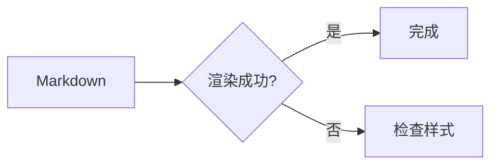

# 一级标题

这是一篇用于检查主题排版的测试文章，涵盖常用 Markdown、GFM、数学公式和 Mermaid 图表。

## 二级标题

### 三级标题

#### 四级标题

##### 五级标题

###### 六级标题

## 文本样式

普通文本、**粗体文本**、*斜体文本*、***粗斜体文本***、~~删除线文本~~、`行内代码`。

这是第一行，行末使用两个空格强制换行。  
这是第二行。

特殊字符可以转义：\*星号\*、\# 井号、\[方括号\]。

## 链接与图片

这是[行内链接](https://astro.build/)，这是使用引用的[参考链接][astro]，也可以自动识别 <https://astro.build/> 和 <mail@example.com>。


[astro]: https://astro.build/ "Astro"

## 引用

> 这是一段引用。
>
> > 这是嵌套引用，其中包含 **粗体** 和 `代码`。

## 列表

- 无序列表第一项
- 无序列表第二项
  - 二级列表
    - 三级列表

1. 有序列表第一项
2. 有序列表第二项
   1. 二级有序列表
   2. 另一项

- [x] 已完成任务
- [ ] 未完成任务

## 代码

行内代码示例：`const message = 'Hello, Astro';`。

```ts
interface Post {
  title: string;
  published: boolean;
}

const post: Post = {
  title: 'Markdown 排版测试',
  published: true
};

console.log(post.title);
```

```diff
- const theme = 'old';
+ const theme = 'Eidolon';
```

    这是使用四个空格缩进的代码块。

## 表格

| 左对齐 | 居中 | 右对齐 |
| :--- | :---: | ---: |
| 文本 | **粗体** | 100 |
| `code` | [链接](https://astro.build/) | 200 |

## 分隔线

---

分隔线前后的正文用于检查垂直间距。

## 脚注

这句话包含一个脚注。[^note]

[^note]: 这是脚注内容，其中也可以包含 **Markdown**。

## 数学公式

行内公式：$E = mc^2$。

块级公式：

$$
\int_{-\infty}^{\infty} e^{-x^2}\,dx = \sqrt{\pi}
$$

## Mermaid 图表



## HTML 元素

<details>
  <summary>展开原生 HTML 内容</summary>
  <p>这是一段位于 details 元素中的内容。</p>
</details>

<kbd>Ctrl</kbd> + <kbd>K</kbd>

## 主题短代码

[hint type="info" title="信息提示"]
这是一个信息提示块，包含 **Markdown 文本**。
[/hint]

[collapse title="折叠内容"]
这里是折叠区域中的内容。

- 列表项目
- 另一项目
[/collapse]

[tabs title="选项卡测试"]
[tab name="选项一" selected]
第一个选项卡的内容。
[/tab]
[tab name="选项二"]
第二个选项卡的内容。
[/tab]
[/tabs]

[button href="https://astro.build/"]访问 Astro[/button]

[tag type="success"]成功标签[/tag]

## 段落收尾

最后一段用于观察文章底部留白、正文行高以及中英文混排效果。The quick brown fox jumps over the lazy dog. 0123456789。
